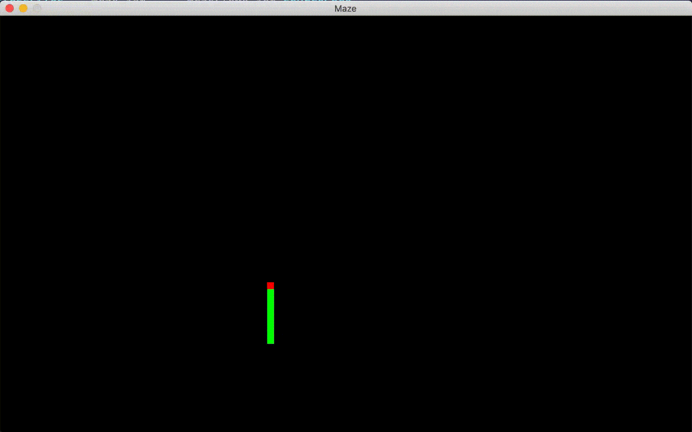

# Maze Generator
[](https://opensource.org/licenses/MIT)

## Description 

A simple real time maze generator utilizing depth first search (DFS) algorithm to generate the pathways. 

I decided to build this project to put the depth first algorithm to use in a practical sense, and I also designed the application to display the creation of the map in real time so that the depth first traversal could be visualized step by step.



## Table of Contents

* [Installation](#installation)
* [Usage](#usage)
* [Troubleshooting](#troubleshooting)

## Installation

From the command line

**Step 1:** `javac MazeApp.java`

**Step 2 (Optional, creates jar file):** 
```
echo Main-Class: MazeApp > manifest.txt
jar cvfm Maze.jar manifest.txt *.class
```

## Usage 

**Run Application:** `java MazeApp`  
or  
**If using the optional jar build:** `java -jar Maze.jar`

**Change Maze Colors:**  While the application is running click anywhere on the display canvas to randomly generate new color themes.

## Troubleshooting

Last tested with OpenJDK version 15
